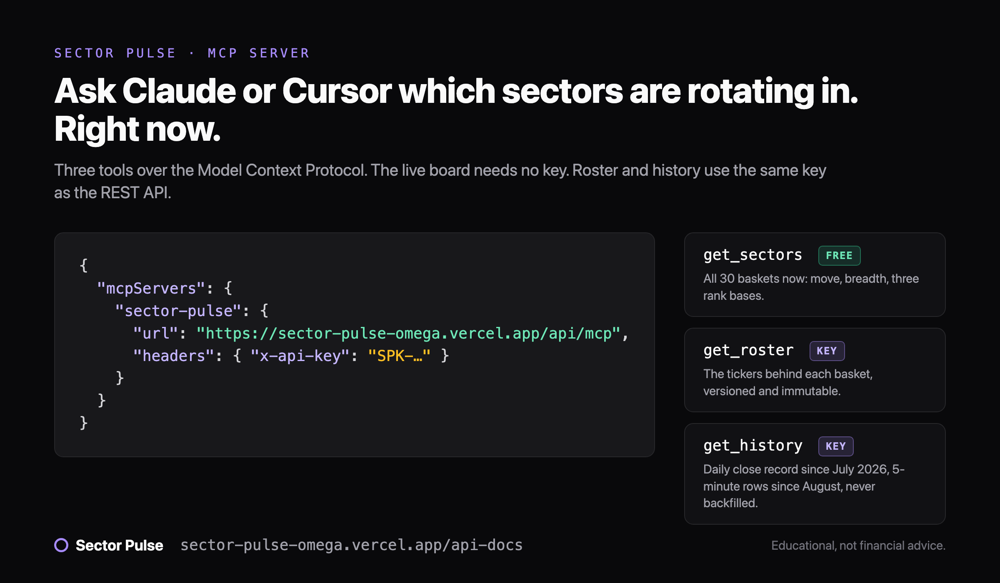

# Sector Pulse MCP server

Live US sector rotation for agents. Sector Pulse tracks 30 US equity sector baskets (AI data center, cloud, BTC miners, nuclear, rare earth, and 25 more), ranks them by average move every session, and records the close ranks daily since July 21, 2026. The record is never backfilled, and the basket rosters are versioned, so a backtest knows exactly what a basket held on any date.

This is a hosted (remote) server over Streamable HTTP. There is nothing to install.

- Endpoint: `https://sector-pulse-omega.vercel.app/api/mcp`
- Docs: https://sector-pulse-omega.vercel.app/api-docs
- OpenAPI: https://sector-pulse-omega.vercel.app/openapi.json
- Official registry: `io.github.christianhonap7-sys/sector-pulse`



## Tools

| Tool | Key | What it returns |
|---|---|---|
| `get_sectors` | none | The live board: all 30 baskets with average move, median, breadth, and three rank bases (session, close basis, previous close). 10 calls a minute per IP. |
| `get_roster` | required | The ticker lists behind each basket, versioned and immutable. Pass `version` for an archived roster. |
| `get_history` | required | The daily close record for a date (rank, move, breadth per sector), or 5-minute intraday rows with `intraday: true`. Daily from 2026-07-21, intraday from 2026-08-19. |

Aggregates only. No quotes, no per-ticker prices.

## Setup

Claude Desktop, Cursor, and other Streamable HTTP clients:

```json
{
  "mcpServers": {
    "sector-pulse": {
      "url": "https://sector-pulse-omega.vercel.app/api/mcp",
      "headers": { "x-api-key": "SPK-YOURKEYHERE" }
    }
  }
}
```

Leave out the `headers` block to use `get_sectors` without a key.

Clients that only speak stdio:

```bash
npx -y mcp-remote https://sector-pulse-omega.vercel.app/api/mcp --header "x-api-key: SPK-YOURKEYHERE"
```

## Keys

The same key works for the REST API and the MCP server. Founding tier: $39 a month, Sector Pulse Pro membership included, 10 founding spots, price locked for as long as you stay. Keys are emailed within a minute of checkout.

https://sector-pulse-omega.vercel.app/pricing

## Rate limits

10 requests a minute per key across REST and MCP. Free `get_sectors` calls: 10 a minute per IP.

## Terms

Educational tool, not financial advice. Derived analytics computed by Sector Pulse, a product of Apex Infra LLC. Keys are for your own applications; redistributing the feed is not permitted. Support: support@apexinfrallc.com
